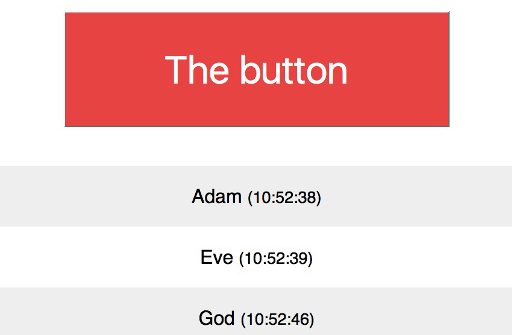

# big-red-button

A big red button for party games where being first at answering something is the objective. Just input your name and be the first to push the button! Everyone instantly sees the list of people who clicked the button. The admin/moderator can reset the list for the next round.

We used it for "guess the song" type of a game and it was a lot of fun.

A fun 1 hour project that I threw together on the last day of 2016. Powered by node.js, socket.io, jQuery.

TODO
- Play a sound when the button is pressed?
